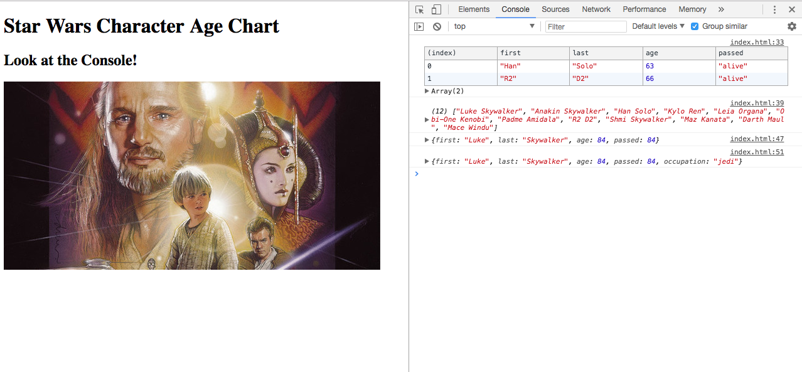

# チャレンジ10

```
所要時間: 30分
ステータス: ドラフト
タイプ: 課題
```

## 目的

- 配列とオブジェクトの基本的な構造を理解する。
- 基本的な配列、オブジェクトを使えるようになる。

## チャレンジの取り組み方

1. マイルストーンごとに要件に合うようにファイルを編集していきます。
2. 分からない部分があれば、テキストを復習して、再度チャレンジしてみましょう。
3. 再チャレンジしてしばらく考えても分からない場合はチャットでメンターに質問しましょう。
4. 完成したら、Dropboxでメンターとファイルを共有して下さい。
5. メンターから課題レビューが届きます。
6. ビデオチャットの際は、分からない点を更に突っ込んで聞いたり、より良い書き方を聞いてみましょう。

## 概要

映画スターウォーズの一部のキャラクターのプロフィールを元に、配列とオブジェクトを使って、ブラウザのコンソールに登場人物の必要な情報のみを、条件に応じて戻り値として返します。

## 完成見本図



## スターターファイル

自分のパソコン上に、challenge10というフォルダを作って、その中に `index.html` というファイルをそれぞれ作成しましょう。それぞれのファイルには以下のスターターファイルの内容をコピーして下さい。

[codegrit-js-unit01-ch10-starter](https://github.com/codegrit-jp-students/codegrit-js-unit01-ch10-starter)

## マイルストーン１

### 要件

- filterを使ってスターウォーズのキャラクターのうち、現在60代のキャラクターだけを戻り値として返してみましょう。テーブルでコンソールに表示させるとみやすく表示されます。
- スターウォーズ登場人物で上記にある全員の苗字と下の名前の配列を戻り値として返してみましょう。
- スプレッド演算子を使って、ルークにジェダイの所属情報（オブジェクト）を追加しましょう。

## 評価

課題の後、以下の２つについてメンターにフィードバックをお願いします。

1. 要件のカバー度: 1.全く出来なかった 2.ほとんど出来なかった 3. 半分ほどは出来た 4.8割ほどは出来た 5. 全部出来た
2. 難易度: 1. とても難しかった 2. 難しかった 3. ちょうど良かった 4. 簡単だった 5. とても簡単だった
